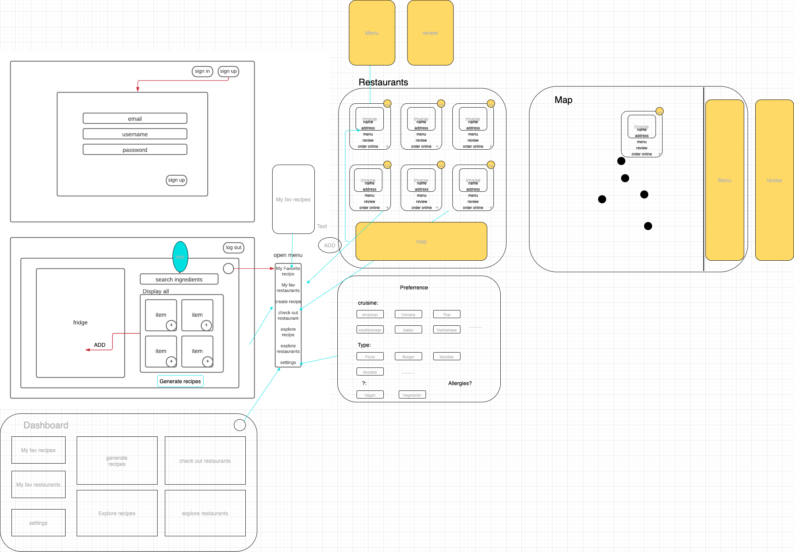

# Ding!

### Date 3/19/2021

### Created By:

#### Queenie Williams

[gitHub](https://github.com/queeniewilliams)
| [linkedIn](https://www.linkedin.com/in/queeni%C3%A9-williams/)

#### Siobahn Schuck

[gitHub](https://github.com/siobahnschuck)
| [linkedIn](https://www.linkedin.com/in/siobahnschuck/)

#### Andrew Liu

[gitHub](https://github.com/andrewliu1988) |
[linkedIn](https://www.linkedin.com/in/andrewliu1988/)

---

### **_Description_**

Ding! is a fullstack application where users can customize their fridge and generate recipe ideas based on what ingredient that have on hand! Solving the ever looming question: "What should I have for dinner!?".

Features:

- Interactive dashboard where you can preset any dietary restrictions or save your favorite recipes for quick access.
- Post your own recipes and share them with the Ding! Community
- Ability to "like" recipes and see what foods are trending

---

### **_Technologies_**

---

### **_Getting Started_**

To view our Trello board click [here](https://trello.com/b/bCG64o2A/p3)

Otherwise visit and sign up for [Ding!](https://glacial-meadow-53009.herokuapp.com/)

---
### Original Concepts

## **_Application Images_**

 

---

### **_Future Updates_**

- [X] ~~Find restaurants in your area~~
- [ ] Text me a grocery list
- [ ] Favorite Recipes
- [ ] "Feeling WILD" random cuisine

---

### **_Credits_**

Inspiration:

Technical:
Recipe Image: [DuckDuckGo](https://duckduckgo.com/)

Recipe Image: [Mindstick Kidszone](https://www.mindstick.com/KidsZone/)

Recipe API: [spoonacular API](https://unsplash.com/photos/nKO_1QyFh9o) 

Restaurant API: [Documenu](https://documenu.com/docs#get_restaurant)

